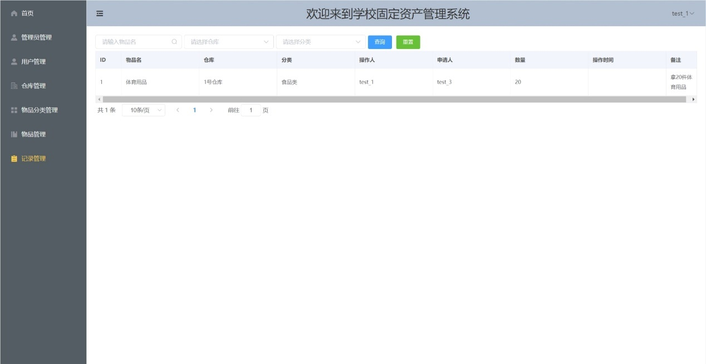

学校固定资产管理系统
===============

介绍
-----------------------------------
学校的资产管理一直是很大的难题，校园仓库管理系统是一个仓库不可缺少的部分，它的内容对于仓库的决策者和管理者来说都至关重要，能够为用户提供充足的信息和便捷的管理手段。

本系统拥有三种权限不同的角色，包括超级管理员，管理员和普通用户，超级管理员的功能包括管理员管理，用户管理，仓库管理，物品分类管理，物品管理，记录管理。管理员的功能包括用户管理，仓库管理，物品分类管理，物品管理，记录管理，普通用户的功能包括物品管理（查看），记录管理（查看）。

功能模块
-----------------------------------
```
┌─管理员管理
│  ├─查询人员
│  ├─增加管理员
│  ├─修改管理员信息
│  └─删除管理员
├─用户管理
│  ├─查询用户
│  ├─增加用户
│  ├─修改用户信息
│  └─删除用户
├─仓库管理
│  ├─查询仓库
│  ├─增加仓库
│  ├─修改仓库信息
│  └─删除仓库
├─物品分类管理 
│  ├─查询物品分类
│  ├─增加物品分类
│  ├─修改物品分类信息
│  └─删除物品分类
├─物品管理
│  ├─入库管理
│  ├─出库管理
│  ├─查询物品
│  ├─增加物品
│  ├─修改物品信息
│  └─删除物品
└─记录管理
   └─查询记录
```

系统效果
----
##### 登录

##### 首页

##### 管理员管理

##### 用户管理

##### 仓库管理

##### 物品分类管理

##### 物品管理

##### 物品管理

##### 记录管理


技术架构
-----------------------------------
#### 开发环境
- 语言：Java 8+ (小于17)
- IDE(JAVA)： IDEA (必须安装lombok插件 )
- IDE(前端)： Vscode、WebStorm、IDEA
- 依赖管理：Maven
- 缓存：Redis
- 数据库脚本：MySQL5.7+（其他数据库，[需要自己转](https://my.oschina.net/jeecg/blog/4905722)）

#### 后端
- 基础框架：Spring Boot 2.7.6
- 持久层框架：MybatisPlus 3.4.2
- 数据库连接池：阿里巴巴Druid 1.1.22
- 日志打印：logback
- 其他：Swagger-ui，lombok（简化代码）等。

#### 前端
- JavaScript框架：Vue
- node
- @vue/cli 
- element-ui
- axios
- vue-router@3.5.4
- vuex@3.0.0
- [Vue 2.6.10](https://cn.vuejs.org/)


开发环境搭建
----
### 前端环境
#### 安装node.js
如果未安装Node.js，请安装它。
```bash
# 验证
# 出现相应npm版本即可
npm -v
# 出现相应node版本即可
node -v
```
### JAVA开发环境
- node-v12.16.0-x64.msi
- jdk-8u191-windows-x64.exe
- apache-maven-3.5.4.zip
- mysql-5.7.26-winx64.zip

项目下载和安装依赖
----

- 拉取项目代码

```
git clone https://github.com/houWenK/Campus-fixed-assets-management-system.git
```

- 安装依赖
```bash
npm install -g @vue/cli
```
```
npm i element-ui -S
```

```
npm install axios --save
```

```
npm i vue-router@3.5.4
```

```
npm i vuex@3.0.0
```

- 开发模式启动
```bash
npm run serve
```
关于作者
----
研究生在读

热爱编程，欢迎大家一起学习和交流

邮箱：454305202@qq.com 